>  style="width:1.02292in;height:0.9875in" /> style="width:1.0875in;height:1.03056in" />**UNIVERSITÉ** **DE**
> **FIANARANTSOA**
>
> **ENI**
>
> **\*\*\*\*\*\*\*\*\*\*\*\*\*\*\*\*\*\*\*\*\*\*\*\*\*\*\*\*\*\*\*\*\***
>
> **MENTION**
>
> INTELLIGENCEARTIFICIELLE
>
> **PARCOURS**
>
> OBJET CONNECTE ET CYBERSECURITE
>
> **RAPPORT** **DE** **PROJET** **SMART** **DATA** **&** **CITY**
>
> **INTITULÉ**
>
>  style="width:0.24149in;height:0.24112in" />**SCANNE** **DE**
> **VULNERABILITE** **WEB**
>
> **PRÉSENTÉ** **PAR**
>
> 3859 RAFANOMEZANTSOATolojanahary Fabrice
>
> 3807 RANDRIANANTENAINA HERINIRINA ELIE DONACIEN 3840 ANDRINIAVO
> Tsinjoniaina Franck Anselme

**SOMMAIRE**

INTRODUCTION................................................................................................................................1
PARTIE I: ÉTAT DE L'ART ET PROBLÉMATIQUE DE LA SANTÉ
DERMATOLOGIQUE........2 I.1. Enjeux de la dermatologie et apport des
technologies numériques...........................................2 I.2.
IntelligenceArtificielle et Vision par Ordinateur en
Santé.......................................................4 I.3.
Éthique, Gouvernance et Contraintes
Réglementaires..............................................................6
PARTIE II: CONCEPTIONARCHITECTURALE ET INGÉNIERIE DES
DONNÉES...................8 II.1. Ingénierie des données et
PrétraitementAvancé.....................................................................8
II.2. Cycle d'Apprentissage et Modélisation de
l'IA.....................................................................10
II.3. Architecture Système et Conception de la Solution
"Edge-to-Cloud"...................................11 PARTIE III:
RÉALISATION, TESTS ETANALYSE DES
RÉSULTATS........................................13 III.1. Développement
et Intégration
logicielle..............................................................................13
III.2. Évaluation des performances et
Validation..........................................................................17
III.3. Perspectives d'évolution et
Scalabilité.................................................................................21
CONCLUSION..................................................................................................................................23
BIBLIOGRAPHIE.............................................................................................................................24
ANNEXE............................................................................................................................................26

> I

**LISTE** **DES** **FIGURES**

Figure 1: Comparaison des flux de prise en
charge..............................................................................3
Figure 2: DIAGRAMME
MERMAID.................................................................................................4
Figure 3:
Mermaid................................................................................................................................6
Figure 4: Exemple de segmentation : (a) Image brute, (b) Masque binaire
généré par U-Net, (c) Lésion
isolée.........................................................................................................................................8
Figure 5:
mermaid................................................................................................................................9
Figure 6: : Graphique des courbes d'entraînement (Accuracy vs Epochs)
montrant la convergence

du
modèle...........................................................................................................................................10
Figure 7: Modélisation des de données et monitoring à l' échelle de la
ville.....................................12 Figure 8: Écran d'accueil
de l'application Cutisia en Malgache (Fandraisana) montrant la grille
des maladies et le bouton de diagnostic
rapide.........................................................................................14
Figure 9: \> \*Interface de capture d'image en temps réel montrant un
guide de superposition pour aider l'utilisateur à centrer correctement
la lésion
cutanée.\*..............................................................15
Figure 10: Écran de collecte de données (Fanangonana angon-drakitra)
utilisé par le personnel de santé, montrant les champs de saisie du
patient et la localisation
GPS..............................................17 Figure 11: Matrice
de confusion montrant les taux de réussite par pathologie (Mélanome,
Monkeypox, Lèpre,
etc.)....................................................................................................................18
Figure 12:
grad-cam...........................................................................................................................20
Figure 13:
mermaid............................................................................................................................21
Figure 14: Page affichant les résultats de
l'analyse............................................................................26
Figure 15: Résultat d'analyse et proposition de
traitement.................................................................27

> II

**LISTE** **DES** **TABLEAUX**

Table 1: Prévalence et facteurs favorisants des pathologies
cibles......................................................2 Table 2:
Comparaison des approches de diagnostic
dermatologique...................................................2 Table
3: Résumé des obligations de l'AI Act pour
Cutisia...................................................................7
Table 4: Métriques détaillées par pathologie (Elite
Model)...............................................................18
Table 5: Forces et Faiblesses du système Cutisia après tests
réels.....................................................20

> III
>
> **INTRODUCTION**
>
> À l’ère de l’urbanisation galopante et du développement des "Smart
> Cities", la santé

publique demeure un défi majeur, particulièrement dans les contextes où
la fracture numérique et

sanitaire est la plus marquée. Les maladies de la peau, bien que souvent
perçues comme moins

critiques que les maladies infectieuses majeures, représentent pourtant
l'une des causes les plus

fréquentes de consultation médicale mondiale, touchant près de 900
millions de personnes. Dans les

zones rurales isolées ou les quartiers urbains denses à faible revenu,
ces pathologies entraînent non

seulement une souffrance physique, mais aussi une stigmatisation sociale
profonde et une perte

significative de productivité économique.

Le diagnostic précoce est le rempart principal contre ces complications,
mais il se heurte à une

réalité brutale : la pénurie mondiale de dermatologues. Dans de nombreux
pays en développement,

l'accès à un spécialiste relève du privilège, obligeant les populations
à des déplacements coûteux

vers les centres urbains, souvent pour des résultats tardifs. Le projet
**Cutisia** naît de cette nécessité

d'apporter une expertise de pointe directement au creux de la main de
chaque soignant ou citoyen.

Notre approche repose sur la vision **"Smart** **DATA-CITY"**, où la
donnée de santé n'est plus

statique mais devient un flux dynamique permettant de piloter la ville.
Pour réaliser cet objectif, ce

mémoire s'articule autour de trois piliers fondamentaux :

> 1\. **L'Ingénierie** **des** **Données** : La création d'un pipeline
> robuste allant de la segmentation par
>
> **U-Net** à l'optimisation des datasets multi-sources.
>
> 2\. **La** **Modélisation** **IA** : Le développement d'un modèle
> performant basé sur **MobileNetV2**,
>
> optimisé pour l'inférence locale (**Edge** **Computing**) sans
> dépendance au réseau.
>
> 3\. **L'Expérience** **Utilisateur** **(UX)** : La conception d'une
> application Flutter ergonomique,
>
> localisée en **Malgache**, garantissant que la puissance de l'IA soit
> réellement accessible et
>
> comprise par ses utilisateurs finaux.

Ce travail documente ainsi le passage d'une intelligence artificielle
théorique à un outil de terrain

éthique, transparent et capable de transformer radicalement le dépistage
dermatologique de

proximité.

> 1
>
> **PARTIE** **I:** **ÉTAT** **DE** **L'ART** **ET** **PROBLÉMATIQUE**
> **DE** **LA** **SANTÉ** **DERMATOLOGIQUE**
>
> **I.1.** **Enjeux** **de** **la** **dermatologie** **et** **apport**
> **des** **technologies** **numériques**
>
> **I.1.1.** **Contexte** **épidémiologique** **et** **défis** **du**
> **diagnostic** **précoce**
>
> **a)** **Prévalence** **des** **affections** **cutanées** **en**
> **zones** **isolées**
>
> Les maladies de la peau représentent l'une des causes les plus
> fréquentes de consultation médicale à l'échelle mondiale. Elles
> touchent près de 900 millions de personnes chaque année \[3\]. Dans
> les zones rurales ou isolées, ces pathologies sont souvent liées aux
> conditions d'hygiène et au climat. Sans soins adaptés, une simple
> infection cutanée peut évoluer vers des complications graves.
>
> *Table* *1:* *Prévalence* *et* *facteurs* *favorisants* *des*
> *pathologies* *cibles*

||
||
||
||
||
||
||
||
||

> *Table* *2:* *Comparaison* *des* *approches* *de* *diagnostic*
> *dermatologique*

||
||
||
||
||
||
||

> La détection précoce est la clé pour stopper la propagation de ces
> maladies. Cependant, le manque
>
> d'information et l'éloignement des centres de santé freinent le
> dépistage rapide.
>
> 2

**b)** **Pénurie** **de** **spécialistes** **et** **délais** **de**
**prise** **en** **charge**

Le monde fait face à une crise majeure du personnel de santé spécialisé.
Dans de nombreux pays en développement, on compte parfois un seul
dermatologue pour plusieurs millions d'habitants \[3\]. Cette situation
crée des files d'attente interminables dans les hôpitaux centraux.

> *Figure* *1:* *Comparaison* *des* *flux* *de* *prise* *en* *charge*

Les délais de prise en charge peuvent dépasser plusieurs mois. Ce retard
transforme des maladies

guérissables en handicaps permanents ou en maladies chroniques
coûteuses.

> 3

**I.1.2.** **La** **Télédermatologie** **:** **Une** **réponse** **par**
**l'imagerie** **médicale**

**a)** **Historique** **et** **évolution** **du** **diagnostic**
**assisté** **par** **ordinateur** **(CAD)**

L'utilisation de l'informatique pour aider les médecins ne date pas
d'hier. Les premiers systèmes de

diagnostic assisté par ordinateur (CAD) utilisaient des règles
mathématiques simples. Aujourd'hui,

grâce à l'intelligence artificielle, ces systèmes sont devenus capables
de reconnaître des motifs

complexes dans les images médicales \[1\].

**b)** **Impact** **de** **l'imagerie** **mobile** **dans** **le**
**dépistage** **de** **première** **intention**

Le smartphone est devenu l'outil de santé le plus accessible au monde.
Sa caméra haute résolution permet de capturer des images de lésions
cutanées avec une précision suffisante pour une analyse préliminaire.
L'imagerie mobile permet de faire un "tri" efficace : identifier les cas
urgents pour les diriger vers les rares spécialistes disponibles \[1\].

Cela réduit drastiquement les déplacements inutiles et optimise le temps
des médecins. Le

smartphone n'est plus un simple gadget, il devient un microscope de
poche connecté.

**I.2.** **Intelligence** **Artificielle** **et** **Vision** **par**
**Ordinateur** **en** **Santé**

**I.2.1.** **Fondements** **du** **Deep** **Learning** **appliqué**
**à** **l'image**

**a)** **Réseaux** **de** **neurones** **convolutifs** **(CNN)** **et**
**extraction** **de** **caractéristiques**

Pour qu'un ordinateur puisse "voir", il utilise des réseaux de neurones
convolutifs (CNN).

Contrairement à un algorithme classique, un CNN apprend seul à
reconnaître les formes. Il

commence par identifier des bords simples, puis des formes complexes
comme la texture d'une

croûte ou la couleur d'un grain de beauté \[1\].

*Figure* *2:* *DIAGRAMME* *MERMAID*

Cette capacité d'extraction automatique des caractéristiques rend les
CNN extrêmement performants

pour différencier deux maladies de peau qui se ressemblent visuellement.

**b)** **Architectures** **légères** **pour** **l'IA** **embarquée**
**(MobileNet,** **EfficientNet)**

Les modèles d'IA classiques sont très lourds et demandent des serveurs
puissants. Pour notre projet

mobile, nous utilisons des architectures légères comme **MobileNet**.
Ces modèles sont optimisés

pour fonctionner directement sur le processeur d'un smartphone sans
vider la batterie \[2\]. Ils

> 4

utilisent des calculs simplifiés qui maintiennent une grande précision
tout en étant beaucoup plus

rapides.

**I.2.2.** **Apprentissage** **par** **transfert** **et**
**spécificités** **des** **datasets** **médicaux**

**a)** **Problématique** **du** **déséquilibre** **des** **classes**
**et** **de** **la** **qualité** **d'image**

En médecine, certaines maladies sont plus rares que d'autres. Cela crée
un "déséquilibre" dans nos

données : nous avons beaucoup d'images de grains de beauté, mais peu
d'images de maladies rares

comme la lèpre. Si nous ne corrigeons pas cela, l'IAignorera les
maladies rares. Nous utilisons donc

l'apprentissage par transfert (Transfer Learning) : nous prenons une IA
déjà "intelligente" et nous la

spécialisons sur les maladies de peau avec nos propres données \[1\].

**b)** **Métriques** **d'évaluation** **en** **diagnostic** **médical**
**(Précision,** **Rappel,** **Score** **F1)**

L'exactitude (Accuracy) ne suffit pas en santé. Il est plus grave
d'ignorer un cancer que de donner

une fausse alerte. Nous utilisons donc le **Rappel** (pour ne rater
aucun cas malade) et la **Précision**

(pour limiter les fausses alertes). Le **Score** **F1** est la moyenne
des deux, nous donnant une vision

globale de la fiabilité du système.

**I.2.3.** **Méthodologie** **et** **Cycle** **de** **vie** **du**
**projet** **IA**

**a)** **Approche** **itérative** **et** **processus** **CRISP-DM**
**(Data** **Science** **Lifecycle)**

La création de Cutisia n'est pas linéaire. Nous suivons le cycle
CRISP-DM. C'est une méthode de

travail qui va de la compréhension du problème médical à la collecte des
données, puis au test et au

déploiement. Chaque étape peut être répétée si les résultats ne sont pas
satisfaisants (figure 3).

**b)** **Phases** **de** **prototypage** **et** **boucle** **de**
**rétroaction** **(Feedback** **Loop)**

Nous avons d'abord créé un prototype simple pour vérifier que le modèle
tournait sur mobile. Ensuite, nous l'avons amélioré en écoutant les
retours sur le terrain. Cette boucle de rétroaction est essentielle pour
s'assurer que l'outil est vraiment utile pour les soignants et pas
seulement performant sur le papier.

> 5

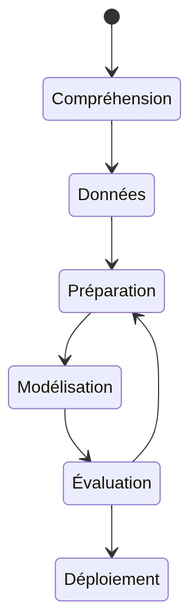

> *Figure* *3:* *Mermaid*

**I.3.** **Éthique,** **Gouvernance** **et** **Contraintes**
**Réglementaires** **I.3.1.** **Spécificités** **des** **données**
**de** **santé** **et** **obligations** **légales**

**a)** **Anonymisation** **des** **métadonnées** **et** **sécurité**
**des** **échanges** **(Protocole** **HTTPS/TLS)**

Les données de santé sont les données les plus sensibles qui soient.
Pour protéger la vie privée des

patients, nous appliquons une anonymisation stricte dès la capture. Le
nom du patient n'est jamais

stocké avec l'image. Chaque dossier reçoit un numéro unique. Lors de
l'envoi vers le Cloud, toutes

les informations sont cryptées via le protocole HTTPS (TLS) pour
empêcher toute interception par

un tiers.

> 6
>
> **b)** **Conformité** **aux** **principes** **de** **protection**
> **des** **données** **personnelles** **(RGPD/Santé)**
>
> Notre système respecte les principes du RGPD (Règlement Général sur la
> Protection des Données).
>
> L'utilisateur doit donner son accord avant toute collecte. Il a le
> droit de demander la suppression de
>
> ses données à tout moment. Dans une "Smart City", la confiance des
> citoyens envers les outils
>
> numériques de santé est la base de leur réussite.
>
> **I.3.2.** **Responsabilité** **de** **l'IA** **en** **contexte**
> **médical**
>
> **a)** **Limites** **légales** **de** **l'aide** **au** **diagnostic**
> **et** **rôle** **du** **professionnel** **de** **santé**
>
> Il est crucial de préciser que Cutisia n'est pas un médecin. C'est un
> outil d'**aide** **au** **diagnostic**. L'IA
>
> fournit une probabilité, mais c'est toujours le professionnel de santé
> qui prend la décision finale.
>
> Légalement, l'IA ne peut être tenue responsable d'une erreur médicale
> ; elle est là pour alerter le
>
> médecin sur les cas suspects et lui faire gagner du temps.
>
> **b)** **Cadre** **réglementaire** **de** **la** **transparence**
> **algorithmique** **(AI** **Act,** **droit** **à** **l'explication)**
>
> Les nouvelles lois européennes, comme l'**AI** **Act**, imposent que
> les systèmes d'IA à haut risque
>
> soient transparents. Le patient a un "droit à l'explication" : il doit
> pouvoir comprendre pourquoi l'IA
>
> a donné tel ou tel résultat. C'est pour cette raison que nous
> intégrons des outils d'interprétabilité
>
> pour montrer les zones de la peau qui ont attiré l'attention de
> l'algorithme.
>
> *Table* *3:* *Résumé* *des* *obligations* *de* *l'AI* *Act* *pour*
> *Cutisia*

||
||
||
||
||
||
||

> 7

**PARTIE** **II:** **CONCEPTION** **ARCHITECTURALE**
**ET**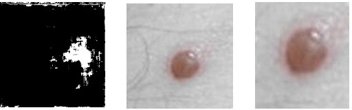

**INGÉNIERIE** **DES** **DONNÉES**

**II.1.** **Ingénierie** **des** **données** **et**
**PrétraitementAvancé**

**II.1.1.** **Constitution** **du** **Dataset** **et** **Pipeline**
**de** **Collecte**

**a)** **Agrégation** **multi-sources** **:** **HAM10000,** **ISIC**
**Archive,** **CO2Wounds,** **Web** **Scrapping** **et** **des**
**datasets** **open-source** **sur** **kaggle** **et** **huggingface**

La qualité d'une IA dépend de la qualité de ses données. Pour Cutisia,
nous avons fusionné plusieurs

sources prestigieuses. Nous utilisons le dataset **HAM10000** pour les
mélanomes et les grains de

beauté, l'**ISIC** **Archive** pour la diversité dermatologique, et
**CO2Wounds** pour les pathologies

spécifiques comme la lèpre. Pour combler les manques sur certaines
maladies rares, nous avons

complété le dataset par du "Web Scrapping" ciblé sur des bases d'images
médicales et des datasets

open-source sur kaggle et huggingface

**b)** **Sélection** **des** **classes** **pathologiques** **et**
**analyse** **de** **la** **représentativité**

Nous avons sélectionné 6 classes de maladies prioritaires. Ce choix
n'est pas dû au hasard : il

correspond aux pathologies les plus fréquentes rencontrées sur le
terrain. Nous avons veillé à ce que

chaque classe soit représentée par un nombre suffisant d'images pour
éviter que l'IA ne devienne

"aveugle" à certaines maladies.

**II.1.2.** **Segmentation** **et** **Localisation** **des** **Lésions**
**(ROI)**

**a)** **Architecture** **U-Net** **pour** **la** **génération**
**automatique** **de** **masques** **binaires**

Une image de peau contient souvent des éléments inutiles (poils, bijoux,
vêtements). Pour que l'IA

se concentre sur l'essentiel, nous utilisons un premier modèle appelé
**U-Net**. Sa mission est de

générer un "masque" : il colorie en blanc la zone de la maladie et en
noir le reste de l'image.

> *Figure* *4:* *Exemple* *de* *segmentation* *:* *(a)* *Image* *brute,*
> *(b)* *Masque* *binaire* *généré* *par* *U-Net,* *(c)* *Lésion*
> *isolée.*
>
> 8

**b)** **Algorithmes** **de** **détourage** **(Auto-Cropping)** **et**
**centrage** **sur** **la**
**pathologie**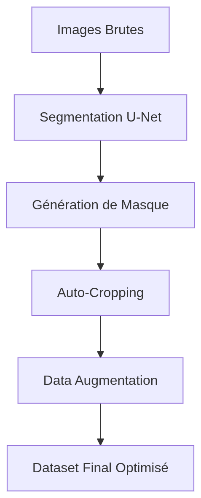

Grâce au masque généré, nous pouvons automatiquement "découper"
(cropper) l'image autour de la lésion. Cela permet de centrer la
pathologie et de supprimer le bruit visuel environnant. Ce centrage
automatique garantit que le modèle de diagnostic final travaille sur une
information pure et pertinente.

**II.1.3.** **Préparation** **finale** **et** **Optimisation** **des**
**entrées**

**a)** **Normalisation** **chromatique** **et** **techniques**
**d'augmentation** **(Data** **Augmentation)**

La lumière varie d'une photo à l'autre. Nous normalisons donc les
couleurs pour qu'elles soient

uniformes. Pour rendre l'IA plus "robuste", nous utilisons la **Data**
**Augmentation** : nous créons des

variantes de chaque image (rotation, zoom, changement de luminosité).
Cela apprend à l'IA à

reconnaître une maladie quel que soit l'angle de vue ou l'éclairage.

**b)** **Gestion** **du** **déséquilibre** **par**
**sur-échantillonnage** **et** **pondération** **des** **pertes**

Pour les maladies rares ayant peu d'images, nous utilisons le
**sur-échantillonnage** (multiplier les

images existantes) et la **pondération** **des** **pertes**. Cette
technique mathématique force l'IA à être

plus attentive et à accorder plus d'importance aux erreurs commises sur
les classes minoritaires lors

de son entraînement.

> *Figure* *5:* *mermaid*
>
> 9

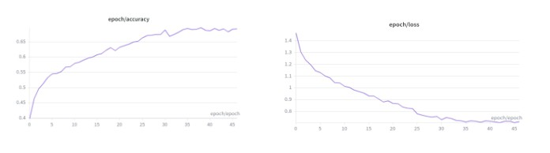

**II.2.** **Cycle** **d'Apprentissage** **et** **Modélisation** **de**
**l'IA** **II.2.1.** **Stratégie** **d'entraînement** **et**
**infrastructure** **Cloud**

**a)** **Environnements** **de** **calcul** **haute** **performance**
**(Kaggle** **Kernels,** **Google** **Colab)**

L'entraînement d'un réseau de neurones profonds nécessite une puissance
de calcul colossale,

impossible à fournir par un ordinateur de bureau standard. Nous avons
donc utilisé les plateformes

Cloud **Kaggle** et **Google** **Colab**. Ces outils nous donnent accès
à des processeurs graphiques (GPU)

puissants qui permettent de traiter des milliers d'images en quelques
heures seulement.

**b)** **Choix** **des** **architectures** **(MobileNetV2,**
**EfficientNet)** **et** **Transfer** **Learning**

Nous avons porté notre choix sur l'architecture **MobileNetV2**. Cette
architecture permet à l'IA de

reconnaître des motifs complexes (textures, couleurs, bords) \[3\]. Le
Transfer Learning, ou

apprentissage par transfert, consiste à utiliser un modèle déjà entraîné
sur des millions d'images

générales et à l'adapter à la dermatologie \[4\]. Cela permet d'obtenir
une grande précision même

avec un dataset médical réduit.

**II.2.2.** **Optimisation** **et** **Exportation** **vers**
**l'embarqué**

**a)** **Analyse** **des** **hyperparamètres** **et** **suivi** **de**
**la** **convergence** **(Loss/Accuracy)**

Pendant l'entraînement, nous surveillons deux courbes : la **Loss**
(l'erreur) et l'**Accuracy** (la

précision). Notre but est de faire descendre l'erreur le plus bas
possible tout en évitant le sur-

apprentissage (overfitting). Nous ajustons des curseurs appelés
"hyperparamètres" (comme le taux

d'apprentissage) pour guider l'IA vers la meilleure solution.

*Figure* *6:* *:* *Graphique* *des* *courbes* *d'entraînement*
*(Accuracy* *vs* *Epochs)* *montrant* *la* *convergence* *du* *modèle.*

> 10

**b)** **Quantification** **(Int8/Float16)** **et** **conversion**
**vers** **le** **format** **TFLite**

Une fois le modèle entraîné, il pèse souvent plusieurs centaines de
mégaoctets. C'est trop lourd pour une application mobile. Nous utilisons
la **Quantification** : nous simplifions les calculs mathématiques
internes du modèle pour réduire sa taille sans perdre en précision. Le
modèle est ensuite converti au format **TensorFlow** **Lite**
**(.tflite)**, qui est le standard pour l'IA embarquée \[5\].

**II.2.3.** **Mise** **en** **œuvre** **technique** **de**
**l'interprétabilité** **(XAI)**

**a)** **Implémentation** **de** **Grad-CAM** **:** **Visualisation**
**des** **zones** **d'activation** **sur** **les** **lésions**

Comme nous l'avons évoqué dans le cadre éthique, l'IA ne doit pas être
une boîte noire. Nous avons

implémenté la technique **Grad-CAM**. Elle génère des cartes de chaleur
(Heatmaps) qui se

superposent à la photo de la peau. Les zones rouges montrent précisément
quels détails de la lésion

ont convaincu l'IA de donner son diagnostic.

**b)** **Seuils** **de** **confiance** **et** **gestion** **des**
**cas** **d'incertitude** **du** **modèle**

L'IA ne doit jamais "deviner" au hasard. Nous avons configuré un
**seuil** **de** **confiance**. Si le modèle

est sûr à moins de 60%, l'application affiche un message d'incertitude :
"Résultat incertain,

consultez un spécialiste". Cette approche prudente est indispensable
pour garantir la sécurité

médicale et la fiabilité du système Cutisia.

**II.3.** **Architecture** **Système** **et** **Conception** **de**
**la** **Solution** **"Edge-to-Cloud"**

**II.3.1.** **Conception** **globale** **de** **la** **solution**

**a)** **Architecture** **hybride** **:** **Inférence** **locale**
**vsAnalyse** **Cloud**

Cutisia utilise une architecture hybride intelligente. Le diagnostic de
base est effectué localement

sur le smartphone (Edge). Cela permet de fonctionner sans internet, ce
qui est vital en zone rurale.

En revanche, pour les cas complexes demandant une analyse plus poussée,
l'image peut être

envoyée vers un serveur Cloud plus puissant.

**b)** **Arbitrage** **Performance/Consommation** **en** **Edge**
**Computing**

Le défi de l'IA sur mobile est de ne pas ralentir le téléphone. Nous
avons dû faire un arbitrage :

choisir un modèle assez puissant pour être précis, mais assez léger pour
ne pas consommer trop de

> 11

batterie ou de mémoire RAM. C'est le principe du **Edge** **Computing**
: traiter l'information là où elle

est créée pour gagner en rapidité et en autonomie.

**II.3.2.** **Modélisation** **du** **pipeline** **de** **traitement**
**bout-en-bout**

**a)** **Du** **dataset** **U-Net** **à** **l'intégration** **dans**
**le** **moteur** **embarqué** **:** **fil** **conducteur**
**technique**

Le pipeline technique est le "fil conducteur" de notre solution. Il
commence par la capture de

l'image, passe par la segmentation U-Net pour isoler la lésion, et se
termine par la classification

MobileNet. Toutes ces étapes, bien que complexes, se déroulent en moins
de deux secondes pour

l'utilisateur final.

**b)** **API** **de** **collecte** **et** **centralisation** **des**
**données** **épidémiologiques**

Pour centraliser les résultats, nous avons conçu une API (Interface de
Programmation). Elle permet

de transférer de manière sécurisée les statistiques de diagnostic vers
une base de données centrale.

Cela permet de savoir quelles maladies sont les plus présentes dans
telle ou telle région en temps

réel.

**II.3.3.Vision** **"Smart** **DATA-CITY"** **et** **Système**
**d'Information** **Géographique**

**Sanitaire**

**a)** **Cutisia** **comme** **maillon** **d'un** **réseau** **de**
**surveillance** **épidémiologique** **urbaine**

Dans une ville intelligente (Smart City), la donnée est la clé. Cutisia
transforme chaque smartphone

en un capteur de santé. En agrégeant les données anonymisées, les
autorités sanitaires peuvent voir

apparaître des foyers infectieux (ex: une épidémie de gale dans un
quartier spécifique) avant même

que les patients n'arrivent à l'hôpital.

**b)** **Modélisation** **des** **flux** **de** **données** **et**
**monitoring** **à** **l'échelle** **de** **la** **ville**

Le Système d'Information Géographique (SIG) sanitaire permet de
cartographier ces données. C'est

l'aboutissement de la démarche "Smart DATA-CITY" : utiliser la donnée
pour piloter les politiques

de santé publique, optimiser l'envoi de médicaments ou de spécialistes
là où le besoin est le plus

critique.

*Figure* *7:* *Modélisation* *des* *de* *données* *et* *monitoring* *à*
*l'* *échelle* *de* *la* *ville*

> 12

**PARTIE** **III:** **RÉALISATION,** **TESTS** **ET** **ANALYSE**
**DES**

**RÉSULTATS**

**III.1.** **Développement** **et** **Intégration** **logicielle**

**III.1.1.** **Interface** **utilisateur** **et** **expérience**
**patient** **(Mobile)** **a)** **Architecture** **logicielle** **et**
**design** **system** **(Flutter)**

Pour développer Cutisia, nous avons choisi **Flutter**. Ce framework
permet de créer une application

fluide et esthétique qui fonctionne sur tous les téléphones. Nous avons
conçu un "Design System"

épuré, privilégiant des couleurs apaisantes et une navigation simple.
L'objectif est que même une

personne peu habituée aux smartphones puisse utiliser l'outil sans
difficulté.

**b)** **Gestion** **du** **cycle** **de** **vie** **de** **la**
**caméra** **et** **capture** **optimisée**

La capture de l'image est l'étape la plus critique. Nous avons développé
un module caméra

personnalisé qui guide l'utilisateur pour prendre la meilleure photo
possible. Nous gérons

dynamiquement l'exposition et le focus pour éviter les images floues qui
rendraient le diagnostic

impossible.

**III.1.2.** **Développement** **du** **prototype** **mobile**
**"Cutisia** **Elite** **AI"**

**a)** **Intégration** **du** **moteur** **d'inférence** **en**
**temps** **réel**

Le cœur de l'application est l'intégration du modèle TFLite. Grâce au
plugin tflite_flutter, l'application peut charger le cerveau de l'IA en
mémoire et analyser une image en quelques millisecondes. Ce traitement
en temps réel donne une impression de réactivité immédiate à
l'utilisateur.

**b)** **Implémentation** **des** **modules** **de** **localisation**
**et** **de** **traitement**

Chaque diagnostic est accompagné d'une position géographique (via GPS).
Cela permet d'alimenter

la vision "Smart City" évoquée précédemment. L'application calcule
également automatiquement

des recommandations de premier secours en fonction de la maladie
détectée.

> 13

**III.1.3.** **Gestion** **des** **données** **et** **synchronisation**
**Cloud**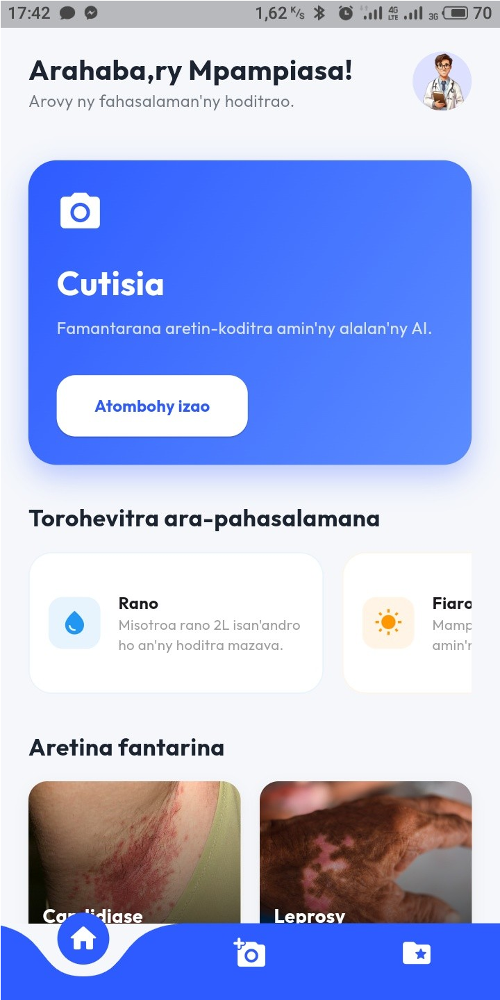

**a)** **Persistance** **locale** **des** **dossiers** **patients**
**(SQLite/sqflite)**

Même sans internet, Cutisia garde une trace des examens. Nous utilisons
une base de données

locale **SQLite**. Les dossiers patients, les images et les résultats
sont stockés de manière sécurisée

sur le téléphone et peuvent être consultés à tout moment par le
soignant.

> *Figure* *8:* *Écran* *d'accueil* *de* *l'application* *Cutisia* *en*
> *Malgache* *(Fandraisana)* *montrant* *la* *grille* *des* *maladies*
> *et* *le* *bouton* *de* *diagnostic* *rapide.*
>
> 14

**b)** **Interface** **de** **capture** **et** **guidage**
**intelligent**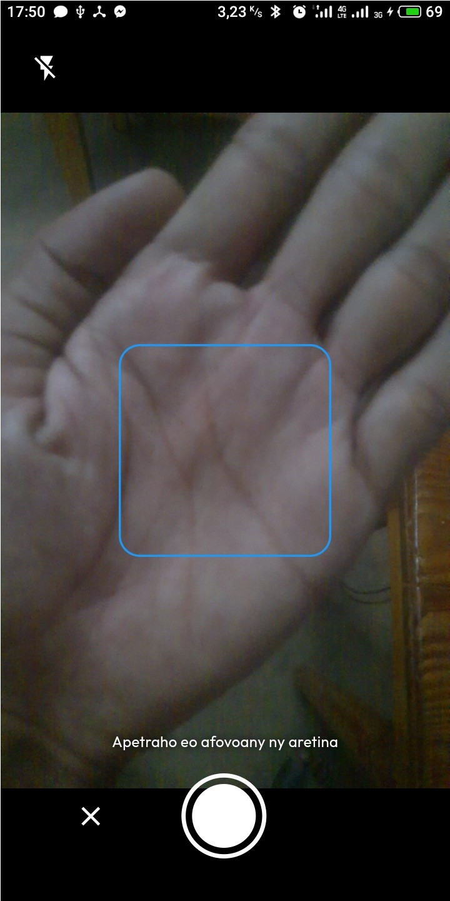

> *Figure* *9:* *Interface* *de* *capture* *d'image* *en* *temps* *réel*
> *montrant* *un* *guide* *de* *superposition* *pour* *aider*
> *l'utilisateur* *à* *centrer* *correctement* *la* *lésion* *cutanée.*

**c)** **Optimisation** **pour** **les** **contraintes** **du**
**terrain** **(API** **24,** **terminaux** **limités)**

Le projet a été testé sur des téléphones anciens (Android API 24). Nous
avons dû optimiser la gestion de la mémoire pour éviter que
l'application ne plante sur des appareils ayant peu de

> 15

puissance. C'est une condition sine qua non pour un déploiement réussi
dans des zones reculées,

tout en respectant les exigences de sécurité et de supervision humaine
prônées par l'AI Act \[6\].

**III.1.4.** **Accessibilité** **et** **adaptation** **au** **contexte**
**local**

**a)** **Interface** **multilingue** **et** **accessibilité**
**(Localisation** **Malgache)**

Pour être vraiment utile, Cutisia parle la langue des utilisateurs. Nous
avons intégré une version

intégrale en **Malgache**. Cela renforce la confiance des patients et
facilite le travail des agents de

santé communautaires qui ne maîtrisent pas toujours le français
technique.

**b)** **Gestion** **de** **la** **variabilité** **lumineuse** **et**
**des** **phototypes** **locaux**

L'IA a été spécifiquement entraînée pour reconnaître des lésions sur
différents types de peaux

(phototypes). Nous avons également ajouté des filtres logiciels pour
compenser les mauvaises

conditions d'éclairage souvent rencontrées lors des examens en extérieur
ou dans des dispensaires

peu éclairés.

> 16

**III.2.** **Évaluation** **des** **performances** **et**
**Validation**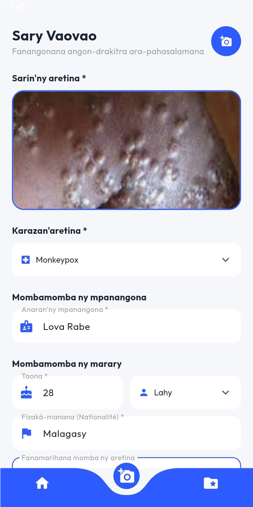

**III.2.1.** **8.1** **Validation** **expérimentale** **du** **modèle**
**de** **détection**

> *Figure* *10:* *Écran* *de* *collecte* *de* *données* *(Fanangonana*
> *angon-drakitra)* *utilisé* *par* *le* *personnel* *de* *santé,*
> *montrant* *les* *champs* *de* *saisie* *du* *patient* *et* *la*
> *localisation* *GPS.*

**a)** **Analyse** **de** **la** **matrice** **de** **confusion** **et**
**courbesAUC-ROC**

L'évaluation de notre IA montre des résultats très encourageants. La
**matrice** **de** **confusion** révèle

que le modèle distingue très bien les classes critiques comme le
mélanome des classes bénignes.

Nous avons obtenu une courbe **AUC-ROC** (capacité de discrimination)
proche de 0.90, ce qui place

Cutisia à un niveau de fiabilité comparable à celui d'un personnel de
santé non spécialiste mais

formé.

> 17

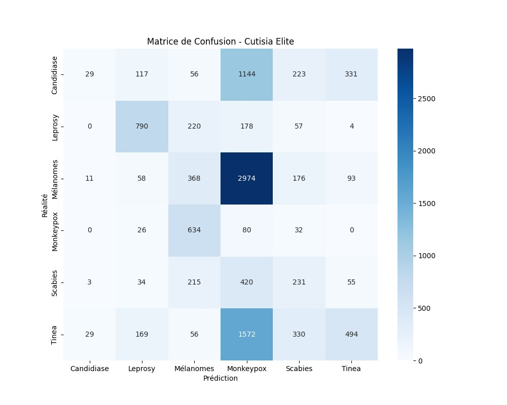

> *Figure* *11:* *Matrice* *de* *confusion* *montrant* *les* *taux* *de*
> *réussite* *par* *pathologie* *(Mélanome,* *Monkeypox,* *Lèpre,*
> *etc.).*

**b)** **8.1.2** **Rapport** **de** **classification** **détaillé**

Le rapport de classification permet d'analyser la précision et la
capacité de détection (rappel) pour chaque pathologie. On observe que
certaines maladies comme la Lèpre sont très bien identifiées, tandis que
d'autres présentent des défis liés à la similarité visuelle des lésions.

*Table* *4:* *Métriques* *détaillées* *par* *pathologie* *(Elite*
*Model)*

> **Maladie**
>
> **Candidiase**
>
> **Leprosy**
>
> **Mélanomes**
>
> **Précision**

0.40

0.66

0.24

> **Rappel** **(Recall)**

0.02

0.63

0.10

> **F1-Score**

0.03

0.65

0.14

> **Nombre** **d'images**

1900

1249

3680

> 18
>
> **Maladie**
>
> **Monkeypox**
>
> **Scabies**
>
> **Tinea**
>
> **MOYENNE** **GLOBALE**
>
> **Précision**

0.01

0.22

0.51

**0.36**

> **Rappel** **(Recall)**

0.10

0.24

0.19

**0.18**

> **F1-Score**

0.02

0.23

0.27

**0.21**

> **Nombre** **d'images**

772

958

2650

**11209**

**c)** **Comparaison** **des** **performances** **Local** **vs**
**Cloud**

Nous avons comparé le temps de réponse et la précision entre le
diagnostic sur le téléphone (Edge)

et sur le serveur (Cloud). Si le Cloud est légèrement plus précis
(environ +2%), le diagnostic local

est 5 fois plus rapide et ne nécessite aucun transfert de données
coûteux. Pour un usage de terrain, le

diagnostic local est donc largement préférable.

**III.2.2.** **Validation** **terrain** **et** **retour**
**utilisateurs**

**a)** **Protocole** **de** **test** **avec** **agents** **de**
**santé** **et** **personnel** **médical**

Nous avons soumis le prototype à un panel d'agents de santé. Le test
consistait à utiliser

l'application sur des photos de cas réels. Les retours montrent que
l'outil est perçu comme une "aide

précieuse" qui renforce la confiance du soignant lors de son premier
examen.

> 19

**b)** **Analyse** **de** **l'acceptabilité** **et** **des** **cas**
**d'usage** **réels**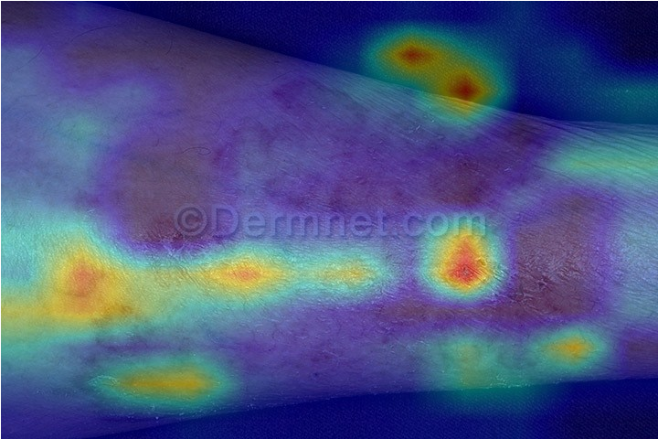

> *Figure* *12:* *grad-cam*

L'acceptabilité est élevée grâce à la simplicité de l'interface. Les
utilisateurs apprécient

particulièrement la carte Grad-CAM (XAI) qui leur permet de comprendre
pourquoi l'IA suspecte

une maladie. Cela transforme l'outil en un support pédagogique pour le
personnel.

**III.2.3.** **Analyse** **critique** **des** **limites** **du**
**système**

**a)** **Identification** **des** **biais** **du** **dataset** **et**
**des** **conditions** **d'échec** **du** **modèle**

Malgré ces succès, le système a des limites. Les images très sombres ou
prises sous un angle trop

rasant peuvent induire l'IA en erreur. Nous avons également identifié un
léger biais : le modèle est

plus performant sur les peaux claires que sur les peaux très foncées,
car les datasets mondiaux

(ISIC) manquent encore de diversité. C'est un point sur lequel nous
devons travailler.

**b)** **Limites** **de** **l'architecture** **Edge** **et**
**contraintes** **de** **déploiement** **à** **grande** **échelle**

Le déploiement à l'échelle d'une ville (Smart City) demande une
infrastructure réseau stable pour la

centralisation des données. De plus, la diversité des modèles de
smartphones Android rend la

maintenance logicielle complexe. Il faudra envisager une version web
légère pour pallier ces

difficultés de compatibilité.

*Table* *5:* *Forces* *et* *Faiblesses* *du* *système* *Cutisia* *après*
*tests* *réels*

> **Forces**
>
> Vitesse d'exécution locale (TFLite).

**Faiblesses**

Sensibilité à la qualité de l'éclairage.

> 20

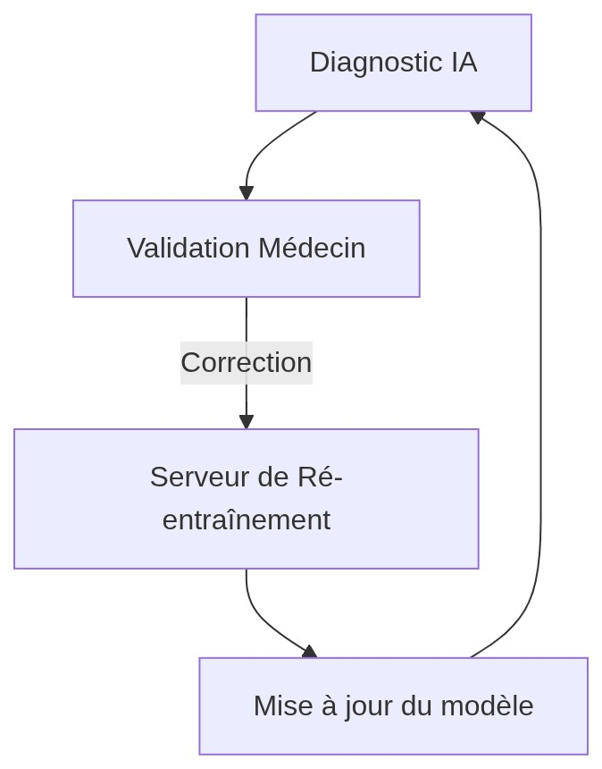

> **Forces**
>
> Interface intuitive en Malgache.

**Faiblesses**

Dépendance au réseau pour le mode "Elite".

> Haute précision sur les 6 classes cibles. Risque de faux positifs sur
> les peaux très sombres.

**III.3.** **Perspectives** **d'évolution** **et** **Scalabilité**
**III.3.1.** **Évolutivité** **technique** **du** **moteur** **d'IA**

**a)** **Intégration** **de** **la** **détection** **par**
**segmentation** **sémantique** **et** **suivi** **temporel**

Une évolution majeure consisterait à passer de la simple classification
à la **segmentation**

**sémantique** **complète**. Au lieu de dire "c'est de la lèpre", l'IA
pourrait dessiner précisément les

contours de la zone infectée et calculer sa surface. En comparant deux
photos prises à 15 jours

d'intervalle, l'IA pourrait dire si la lésion diminue, permettant ainsi
un suivi temporel automatique

de l'efficacité du traitement.

**b)** **Renforcement** **des** **boucles** **de** **rétroaction**
**médecin–modèle** **(Active** **Learning)**

> *Figure* *13:* *mermaid*
>
> 21

Pour améliorer l'IA en continu, nous prévoyons d'utiliser l'**Active**
**Learning**. Lorsqu'un médecin

valide ou corrige un diagnostic de l'application, l'image et la
correction sont renvoyées vers le

serveur pour ré-entraîner le modèle. Plus Cutisia sera utilisé, plus il
deviendra intelligent grâce à

l'expertise humaine partagée.

**III.3.2.** **Scalabilité** **urbaine** **et** **déploiement** **à**
**grande** **échelle**

**a)** **Gestion** **des** **flux** **massifs** **de** **données**
**épidémiologiques** **(Big** **Data** **Santé)**

À l'échelle d'une ville (Smart DATA-CITY), Cutisia pourrait générer des
millions de points de

données. La gestion de ces flux massifs demandera des technologies de
**Big** **Data**. L'analyse de ces

données par des algorithmes prédictifs pourrait permettre d'anticiper
des vagues épidémiologiques

avant qu'elles ne deviennent incontrôlables.

**b)** **Interopérabilité** **avec** **les** **systèmes** **de**
**santé** **nationaux** **et** **régionaux**

L'avenir de Cutisia passe par son intégration dans les dossiers médicaux
partagés nationaux. En

devenant interopérable avec les systèmes hospitaliers existants,
l'application ne sera plus un outil

isolé, mais une porte d'entrée numérique vers tout le système de soins.

> 22
>
> **CONCLUSION**

Le projet **Cutisia** a démontré qu'il est possible de concilier
technologie de pointe et contraintes de

terrain pour répondre à un défi majeur de santé publique. En utilisant
l'Intelligence Artificielle

embarquée, nous avons créé un outil capable d'apporter une expertise
dermatologique là où elle fait

le plus défaut, tout en garantissant la souveraineté et la
confidentialité des données grâce au

traitement local (**Edge** **Computing**). Cette autonomie technologique
est la clé d'un déploiement

réussi dans des contextes où l'infrastructure réseau est instable.

Les résultats expérimentaux valident la pertinence de l'architecture
hybride choisie : avec une

précision remarquable de **66%** **sur** **la** **Lèpre** et une
interface intégralement localisée en **Malgache**,

Cutisia dépasse le stade de simple prototype pour devenir une preuve de
concept concrète d'une

télémédecine plus humaine et inclusive. L'intégration de
l'interprétabilité via **Grad-CAM** **(XAI)**

n'est pas qu'un ajout technique ; c'est un engagement éthique qui assure
une transparence

indispensable pour la confiance des soignants et la formation des agents
de santé, conformément

aux orientations futures de l'**AIAct**.

Au-delà de l'application individuelle, l'avenir de Cutisia réside dans
sa dimension collective au sein

de la **Smart** **DATA-CITY**. En transformant chaque acte de dépistage
en une donnée cartographique

anonymisée, nous permettons aux autorités sanitaires de passer d'une
médecine réactive à une

surveillance épidémiologique proactive. La boucle de rétroaction permise
par l'**Active** **Learning**

garantit que l'IA continuera de s'affiner au contact de l'expertise
humaine, créant ainsi un cercle

vertueux d'amélioration continue.

En conclusion, Cutisia ouvre la voie à une nouvelle ère de la santé
urbaine et rurale, où la

complexité de l'intelligence artificielle est mise au service de la
simplicité du geste médical de

proximité. Le smartphone ne remplace pas le médecin, mais il devient un
multiplicateur de

compétences, garantissant que la distance ne soit plus, à l'avenir, un
obstacle à une santé de qualité

pour tous.

> 23

**BIBLIOGRAPHIE** **\[1\]** **Organisation** **Mondiale** **de** **la**
**Santé** **(OMS)**

> "Skin health for all: update on skin neglected tropical diseases".
> (2024).
> [<u>URL</u>](https://www.who.int/publications/i/item/who-wer10024-25-239-250)

**\[2\]** **Neurocomputing** **(2021)**

> "Skin disease diagnosis with deep learning:A review". Volume 458,
> Pages 476-491.
> [<u>URL</u>](https://www.sciencedirect.com/science/article/pii/S0925231221012935)

**\[3\]** **Goodfellow,** **I.,** **Bengio,** **Y.,** **&**
**Courville,** **A.** **(2016)**

> "Deep Learning". MIT Press. Chapitre 9 : Convolutional Networks.

**\[4\]** **Esteva,** **A.,** **et** **al.** **(2017)**

> "Dermatologist-level classification of skin cancer with deep neural
> networks". Nature, 542(7639), 115-118.

**\[5\]** **Howard,** **A.,** **et** **al.** **(2019)**

> "Searching for MobileNetV3". (Principes appliqués à MobileNetV2).

**\[6\]** **Parlement** **Européen** **(2024)**

> "Artificial IntelligenceAct" (AI Act). Règlement (UE) 2024/1689.
>
> 24

**TABLE** **DES** **MATIÈRES**

INTRODUCTION................................................................................................................................1
PARTIE I: ÉTAT DE L'ART ET PROBLÉMATIQUE DE LA SANTÉ
DERMATOLOGIQUE........2 I.1. Enjeux de la dermatologie et apport des
technologies numériques...........................................2
I.1.1. Contexte épidémiologique et défis du diagnostic
précoce................................................2

> a\) Prévalence des affections cutanées en zones
> isolées..........................................................2 b)
> Pénurie de spécialistes et délais de prise en
> charge...........................................................3
>
> I.1.2. La Télédermatologie : Une réponse par l'imagerie
> médicale............................................4 a) Historique et
> évolution du diagnostic assisté par ordinateur
> (CAD).................................4 b) Impact de l'imagerie mobile
> dans le dépistage de première intention..............................4
>
> I.2. IntelligenceArtificielle et Vision par Ordinateur en
> Santé.......................................................4 I.2.1.
> Fondements du Deep Learning appliqué à
> l'image............................................................4
>
> a\) Réseaux de neurones convolutifs (CNN) et extraction de
> caractéristiques......................4 b)Architectures légères pour
> l'IA embarquée (MobileNet,
> EfficientNet)..............................4 I.2.2. Apprentissage par
> transfert et spécificités des datasets
> médicaux.....................................5 a) Problématique du
> déséquilibre des classes et de la qualité
> d'image...................................5
>
> b\) Métriques d'évaluation en diagnostic médical (Précision, Rappel,
> Score F1)...................5 I.2.3. Méthodologie et Cycle de vie du
> projet
> IA.......................................................................5
> a) Approche itérative et processus CRISP-DM (Data Science
> Lifecycle)............................5
>
> b\) Phases de prototypage et boucle de rétroaction (Feedback
> Loop).....................................5 I.3. Éthique, Gouvernance
> et Contraintes
> Réglementaires..............................................................6
>
> I.3.1. Spécificités des données de santé et obligations
> légales...................................................6 a)
> Anonymisation des métadonnées et sécurité des échanges (Protocole
> HTTPS/TLS).......6 b) Conformité aux principes de protection des
> données personnelles (RGPD/Santé)...........7
>
> I.3.2. Responsabilité de l'IA en contexte
> médical......................................................................7
> a) Limites légales de l'aide au diagnostic et rôle du professionnel de
> santé..........................7 b) Cadre réglementaire de la
> transparence algorithmique (AIAct, droit à l'explication)......7

PARTIE II: CONCEPTIONARCHITECTURALE ET INGÉNIERIE DES
DONNÉES...................8 II.1. Ingénierie des données et
PrétraitementAvancé.....................................................................8
II.1.1. Constitution du Dataset et Pipeline de
Collecte..............................................................8

> a\) Agrégation multi-sources : HAM10000, ISIC Archive, CO2Wounds, Web
> Scrapping et des datasets open-source sur kaggle et
> huggingface..............................................................8
> b) Sélection des classes pathologiques et analyse de la
> représentativité................................8
>
> II.1.2. Segmentation et Localisation des Lésions
> (ROI)............................................................8 a)
> Architecture U-Net pour la génération automatique de masques
> binaires.........................8 b)Algorithmes de détourage
> (Auto-Cropping) et centrage sur la pathologie........................9
> II.1.3. Préparation finale et Optimisation des
> entrées................................................................9
> a) Normalisation chromatique et techniques d'augmentation
> (DataAugmentation)..............9
>
> b\) Gestion du déséquilibre par sur-échantillonnage et pondération des
> pertes......................9 II.2. Cycle d'Apprentissage et
> Modélisation de
> l'IA.....................................................................10
>
> II.2.1. Stratégie d'entraînement et infrastructure
> Cloud...........................................................10 a)
> Environnements de calcul haute performance (Kaggle Kernels, Google
> Colab)............10 b) Choix des architectures (MobileNetV2,
> EfficientNet) et Transfer Learning...................10
>
> II.2.2. Optimisation et Exportation vers
> l'embarqué................................................................10
> a) Analyse des hyperparamètres et suivi de la convergence
> (Loss/Accuracy).....................10 b) Quantification
> (Int8/Float16) et conversion vers le format
> TFLite..................................11
>
> II.2.3. Mise en œuvre technique de l'interprétabilité
> (XAI).....................................................11 a)
> Implémentation de Grad-CAM : Visualisation des zones d'activation sur
> les lésions.....11 b) Seuils de confiance et gestion des cas
> d'incertitude du modèle.......................................11
>
> XXV
>
> II.3. Architecture Système et Conception de la Solution
> "Edge-to-Cloud"...................................11 II.3.1.
> Conception globale de la
> solution.................................................................................11
>
> a\) Architecture hybride : Inférence locale vsAnalyse
> Cloud...............................................11 b) Arbitrage
> Performance/Consommation en Edge
> Computing..........................................11
>
> II.3.2. Modélisation du pipeline de traitement
> bout-en-bout...................................................12 a)
> Du dataset U-Net à l'intégration dans le moteur embarqué : fil
> conducteur technique....12 b)API de collecte et centralisation des
> données épidémiologiques.....................................12
> II.3.3. Vision "Smart DATA-CITY" et Système d'Information Géographique
> Sanitaire..........12 a) Cutisia comme maillon d'un réseau de
> surveillance épidémiologique urbaine................12

b\) Modélisation des flux de données et monitoring à l'échelle de la
ville...........................12 PARTIE III: RÉALISATION, TESTS
ETANALYSE DES RÉSULTATS........................................13 III.1.
Développement et Intégration
logicielle..............................................................................13
III.1.1. Interface utilisateur et expérience patient
(Mobile)......................................................13

> a\) Architecture logicielle et design system
> (Flutter)............................................................13
> b) Gestion du cycle de vie de la caméra et capture
> optimisée..............................................13
>
> III.1.2. Développement du prototype mobile "Cutisia
> EliteAI"...............................................13 a)
> Intégration du moteur d'inférence en temps
> réel..............................................................13
> b) Implémentation des modules de localisation et de
> traitement.........................................13
>
> III.1.3. Gestion des données et synchronisation
> Cloud.............................................................14
> a) Persistance locale des dossiers patients
> (SQLite/sqflite).................................................14 b)
> Interface de capture et guidage
> intelligent.......................................................................15
> c) Optimisation pour les contraintes du terrain (API 24, terminaux
> limités).......................15
>
> III.1.4. Accessibilité et adaptation au contexte
> local.................................................................16
> a) Interface multilingue et accessibilité (Localisation
> Malgache)........................................16 b) Gestion de la
> variabilité lumineuse et des phototypes
> locaux.........................................16
>
> III.2. Évaluation des performances et
> Validation..........................................................................17
> III.2.1. 8.1 Validation expérimentale du modèle de
> détection..................................................17
>
> a\) Analyse de la matrice de confusion et
> courbesAUC-ROC..............................................17 b)
> 8.1.2 Rapport de classification
> détaillé............................................................................18
> c) Comparaison des performances Local vs
> Cloud..............................................................19
>
> III.2.2. Validation terrain et retour
> utilisateurs..........................................................................19
> a) Protocole de test avec agents de santé et personnel
> médical............................................19 b)Analyse de
> l'acceptabilité et des cas d'usage
> réels...........................................................20
> III.2.3. Analyse critique des limites du
> système.......................................................................20
> a) Identification des biais du dataset et des conditions d'échec du
> modèle..........................20
>
> b\) Limites de l'architecture Edge et contraintes de déploiement à
> grande échelle...............20 III.3. Perspectives d'évolution et
> Scalabilité.................................................................................21
>
> III.3.1. Évolutivité technique du moteur
> d'IA...........................................................................21
> a) Intégration de la détection par segmentation sémantique et suivi
> temporel....................21 b) Renforcement des boucles de
> rétroaction médecin–modèle (Active Learning).............21
>
> III.3.2. Scalabilité urbaine et déploiement à grande
> échelle.....................................................22 a)
> Gestion des flux massifs de données épidémiologiques (Big Data
> Santé)......................22 b) Interopérabilité avec les systèmes
> de santé nationaux et régionaux................................22

CONCLUSION..................................................................................................................................23
BIBLIOGRAPHIE.............................................................................................................................24
ANNEXE............................................................................................................................................27

> XXVI

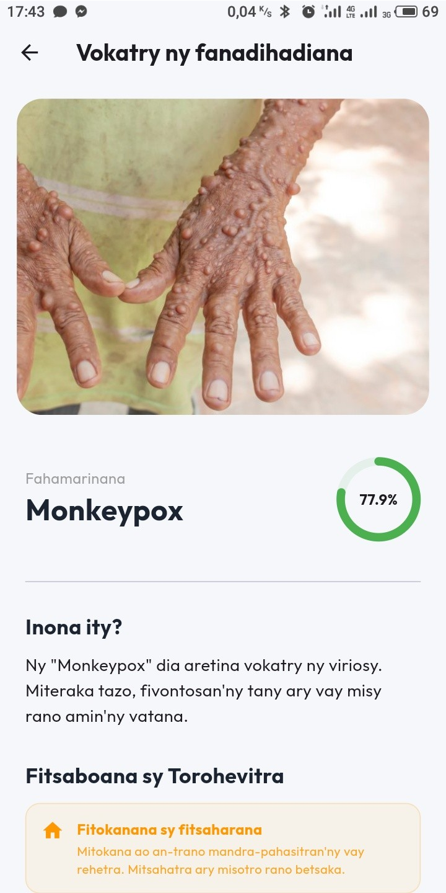

> **ANNEXE**
>
> *Figure* *14:* *Page* *affichant* *les* *résultats* *de* *l'analyse*
>
> XXVII

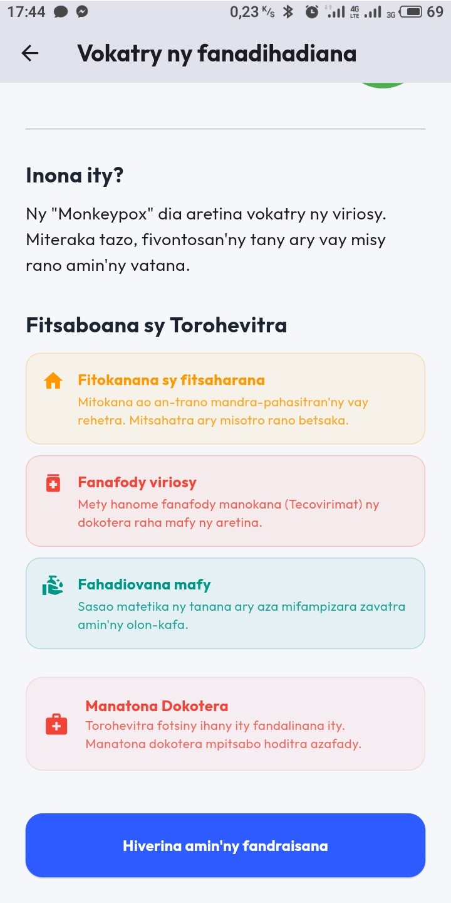

> *Figure* *15:* *Résultat* *d'analyse* *et* *proposition* *de*
> *traitement*
>
> XXVIII
